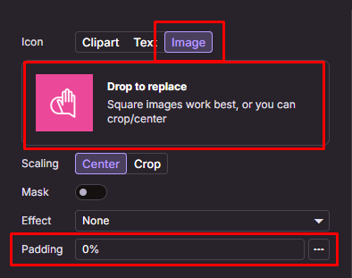

# Change flutter icon launcher

Make sure you have figma, photoshop or something to make the design icon with size 512 px x 512px

After design your icons launcher export that and make sure the size is 512 px

1. Open the website [icon kitchen](https://icon.kitchen/)
2. Then choose image in menu icons and pick your design icons before
3. Make padding have 0% (⚠ this will be make your icons launcher not have padding its looks good)

   

4. Background you can use default or white
5. If all already done you can click button download in top right
6. After download extract it and goto android/res folder inside a extract
7. Copy all mipmap to your project folder android/app/src/main/res/ paste all on there
8. Then debug or release your app

Just it thats how to change icon flutter, Happy Coding 😆
